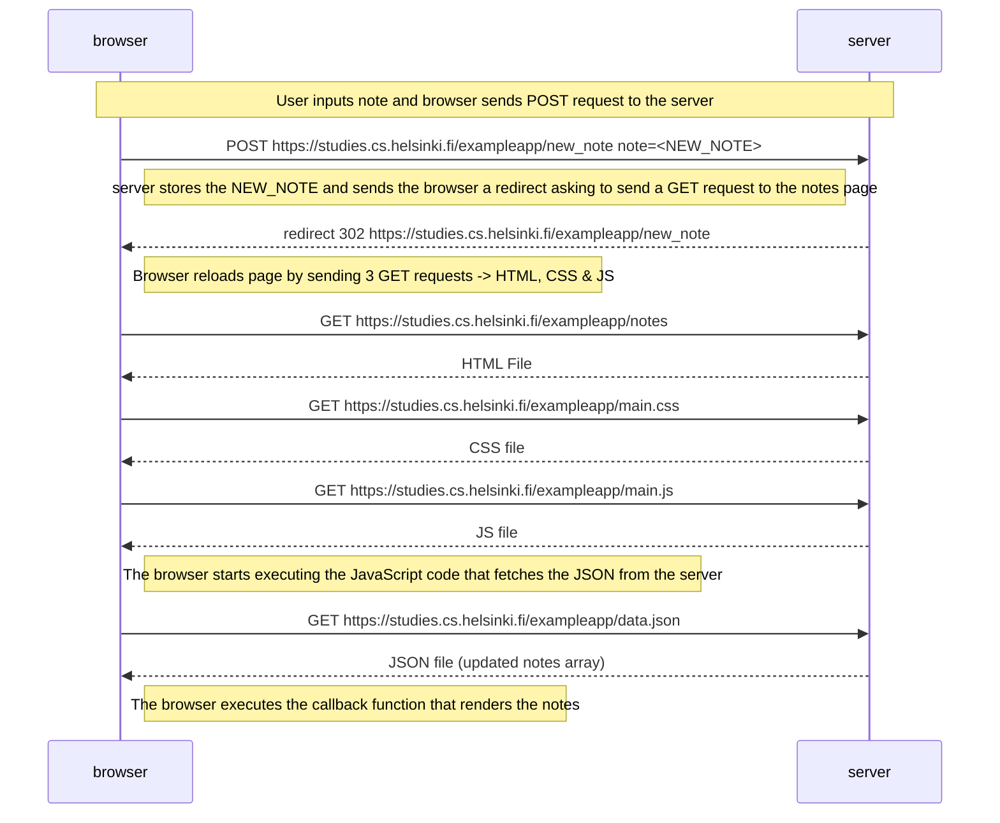

```mermaid 
sequenceDiagram
    participant browser
    participant server

	note over browser,server:  User inputs note and browser sends POST request to the server
    
	browser->>server: POST https://studies.cs.helsinki.fi/exampleapp/new_note note=<NEW_NOTE>
	note left of server: server stores the NEW_NOTE and sends the browser a redirect asking to send a GET request to the notes page
    server-->>browser: redirect 302 https://studies.cs.helsinki.fi/exampleapp/new_note
 
	note right of browser: Browser reloads page by sending 3 GET requests -> HTML, CSS & JS
    
	browser->>server: GET https://studies.cs.helsinki.fi/exampleapp/notes
    server-->>browser: HTML File
  
    browser->>server: GET https://studies.cs.helsinki.fi/exampleapp/main.css
    server-->>browser: CSS file

	browser->>server: GET https://studies.cs.helsinki.fi/exampleapp/main.js
    server-->>browser: JS file

    Note right of browser: The browser starts executing the JavaScript code that fetches the JSON from the server
    browser->>server: GET https://studies.cs.helsinki.fi/exampleapp/data.json
    server-->>browser: JSON file (updated notes array) 
    Note right of browser: The browser executes the callback function that renders the notes
```