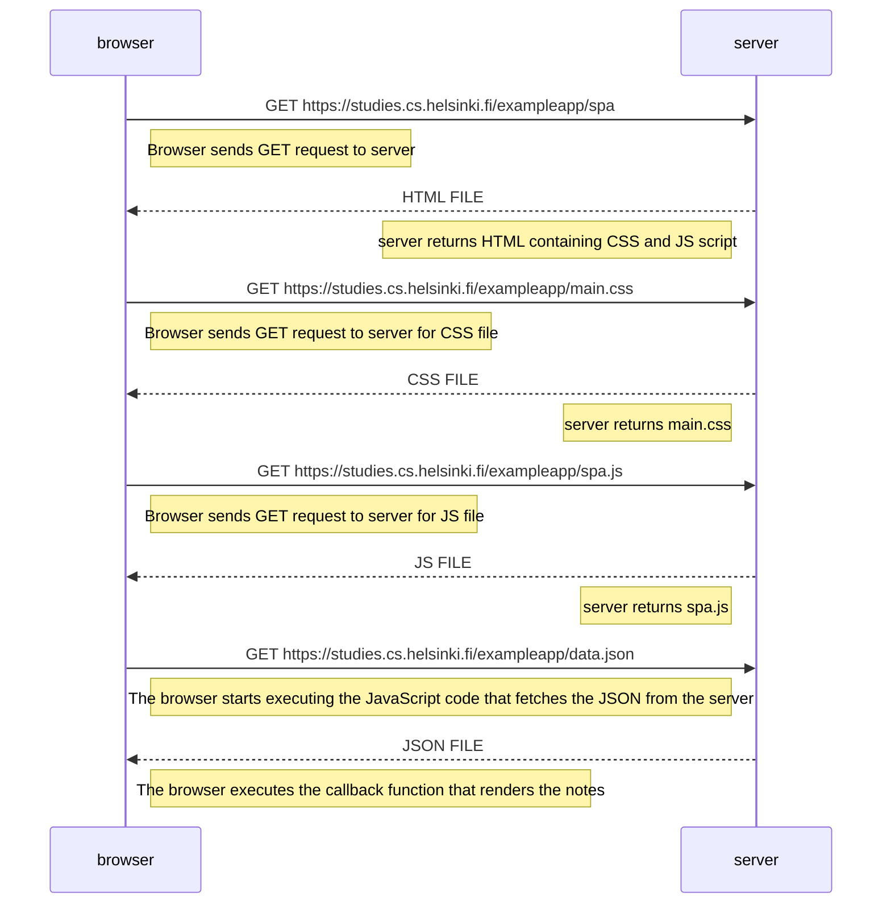

```mermaid 
sequenceDiagram
    participant browser
    participant server

	browser->>server: GET https://studies.cs.helsinki.fi/exampleapp/spa
	note right of browser:  Browser sends GET request to server
    server-->>browser: HTML FILE
	note left of server: server returns HTML containing CSS and JS script
	

	browser->>server: GET https://studies.cs.helsinki.fi/exampleapp/main.css
	note right of browser:  Browser sends GET request to server for CSS file
	server-->>browser: CSS FILE
	note left of server: server returns main.css
	

	browser->>server: GET https://studies.cs.helsinki.fi/exampleapp/spa.js
    note right of browser:  Browser sends GET request to server for JS file
    server-->>browser: JS FILE
	note left of server: server returns spa.js


    browser->>server: GET https://studies.cs.helsinki.fi/exampleapp/data.json
    note right of browser: The browser starts executing the JavaScript code that fetches the JSON from the server
    server-->>browser: JSON FILE 
    Note right of browser: The browser executes the callback function that renders the notes
```