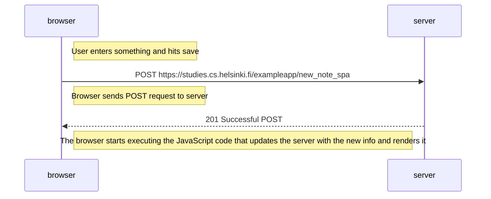

```mermaid 
sequenceDiagram
    participant browser
    participant server

	note right of browser:  User enters something and hits save

	browser->>server: POST https://studies.cs.helsinki.fi/exampleapp/new_note_spa
	note right of browser:  Browser sends POST request to server
    
    server-->>browser: 201 Successful POST
    Note right of browser: The browser starts executing the JavaScript code that  updates the server with the new info and renders it

```