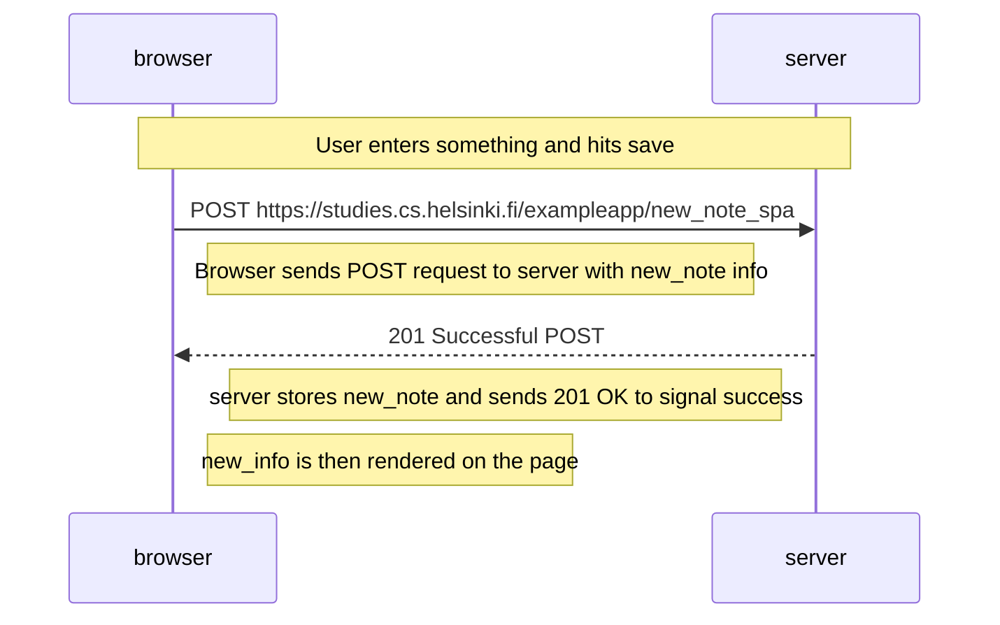

```mermaid 
sequenceDiagram
    participant browser
    participant server

	note over browser, server:  User enters something and hits save

	browser->>server: POST https://studies.cs.helsinki.fi/exampleapp/new_note_spa
	note right of browser:  Browser sends POST request to server with new_note info
    
    server-->>browser: 201 Successful POST
	note left of server: server stores new_note and sends 201 OK to signal success
    note right of browser: new_info is then rendered on the page
```